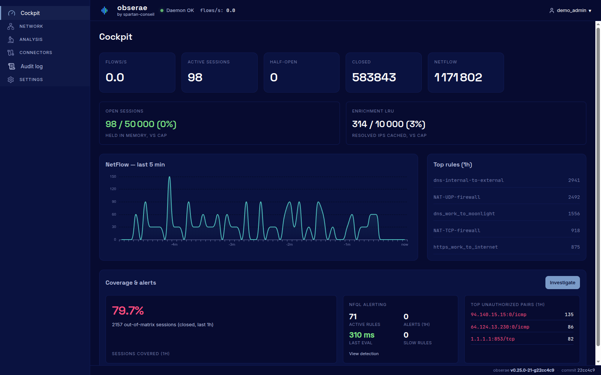

# Obserae

**Self-hosted Network Detection & Response built from NetFlow and IPFIX.**

Obserae turns network flow data into security context you can understand and act on.



It helps you model your network architecture — networks, hosts, groups, services and expected communications — then detect and investigate the traffic that does not belong.

> **Your architecture defines what should happen.  
> Obserae detects what does not.**

Instead of investigating raw flow records such as:

```text
10.42.18.7 → 10.27.4.12:5432
```

investigate meaningful relationships:

```text
vpn-contractor → finance-postgres
PostgreSQL / TCP 5432
No matching Flow Matrix rule
```

## A different kind of NDR

Most network tools show traffic.

Obserae helps you understand whether that traffic is expected.

It combines flow collection, network cartography, connectivity modelling and detection into one local platform:

- **Collect** NetFlow v5/v9 and IPFIX from routers, firewalls and hosts.
- **Map** networks, hosts, groups, interfaces and services by name.
- **Model** the communications your environment is supposed to allow.
- **Detect** sessions that do not match the intended architecture.
- **Investigate** activity through named assets, groups, services, ports and protocols.
- **Alert** through local and enterprise-ready outputs.
- **Document** your network and its intended security posture.

Obserae is an NDR focused on detection, investigation and alerting. It does not perform packet capture, replace a SIEM, or claim to provide autonomous remediation.

## Designed for security teams

Obserae is built for environments where network telemetry should remain under your control.

- Self-hosted deployment
- Local storage
- Offline-capable operation
- No product telemetry
- No online licence validation
- Linux `amd64` and `arm64` support, including Raspberry Pi 4 and 5

It is suitable for security consultants, internal security teams and organisations that need practical network detection without sending flow data to a third-party cloud.


## Learn more and download

Documentation, product information, downloads, release verification and deployment guidance are available at:

# [obserae.com](https://obserae.com)

## This repository

This repository is the public distribution, release and issue-tracking location for Obserae.

| File | Purpose |
|---|---|
| [CHANGELOG.md](CHANGELOG.md) | Release history and upgrade notes. |
| [LICENSING.md](LICENSING.md) | Licence levels, intended usage and transparency information. |
| [EULA.txt](EULA.txt) | Binding French licence terms. |
| [EULA.en.txt](EULA.en.txt) | English courtesy translation of the EULA. |
| [SECURITY.md](SECURITY.md) | Vulnerability reporting process. |
| [SUPPORT.md](SUPPORT.md) | Support channels and support policy. |

## Licensing and support

Obserae is proprietary software distributed as binaries and Docker images. The source code is not published.

Support is provided on a best-effort basis through [GitHub Issues](https://github.com/spartan-conseil/obserae/issues). No SLA is included.

For security vulnerabilities, do not open a public issue. Follow the process described in [SECURITY.md](SECURITY.md).